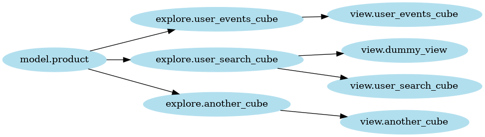

# looker-dependency-graph
Build a dependency graph of your Looker models, explores and views based on LookML files.

It builds upon [`lkml`](https://github.com/joshtemple/lkml) parser and was inspired by [`gazetteer`](https://github.com/mathilda0902/gazetteer).


## Setup
### Your LookML files
Replace the contents of `input/models/` with your own `.model.lkml` files.
### Dependencies
```bash
sudo apt-get install graphviz
poetry install
poetry shell
```

## Run
```bash
python main.py
```

Outputs:


### Filtering the graph output
Use `--filters` argument to only render edges of desired nodes. Example:
```bash
python main.py --filters 'explore.user_events_cube explore.another_cube'
```

Outputs:

