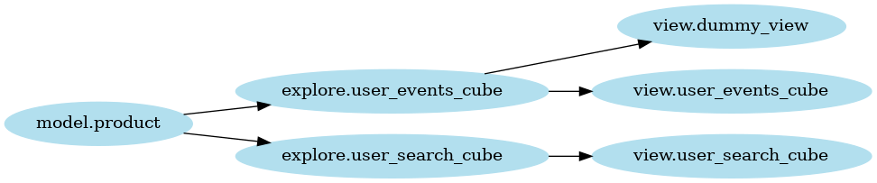

# looker-dependency-graph
Build a dependency graph of your Looker models, explores and views based on LookML files.

## Dependencies
```bash
sudo apt-get install graphviz
poetry install
```

## Setup
Replace the contents of `input/models/` with your own `.model.lkml` files.

## Run
```bash
poetry shell
python main.py
```

Outputs:

### Filtering the graph output
Use `--filters` argument to only render edges of desired nodes. Example:
```bash
python main.py --filters 'explore.user_events_cube explore.another_explore'
```
